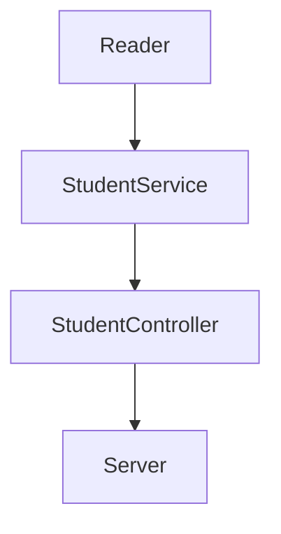

<h1 align="center"> Launch X - BackEnd Mission 🛰️ </h1>

<h2 align="center">
    Visual Thinking API
</h2>

## Design



- `Reader`: read files and get the information given the file name.
- `StudentService`: filtering and mapping operations that are needed.
- `StudentController`: connection between functionality and server.
- `Server`: listening for http requests.

## Dependecies

|     Name     | Description                                                                         |
| ------------ | ----------------------------------------------------------------------------------- |
|     Jest     | Javascript Testing framework for Drive Unit Tests.                                  |
|   Express    | Writing request handlers with different HTTP verbs in different URL paths (routes). |
|    ESLint    | Tool for identifying and reporting on patterns found in ECMAScript/JavaScript code. |

## Notes

Command to rebuild Node modules:

```
npm install
```

## Credits:

Credits to Carlo Gilmar - Software Developer.

Follow him on:

- GitHub: carlogilmar
- Twitter: carlogilmar

And Luis Enrique Mendoza Higuera - Entry-level Software Engineer.

Follow him on:

- Github: enrique-mendoza